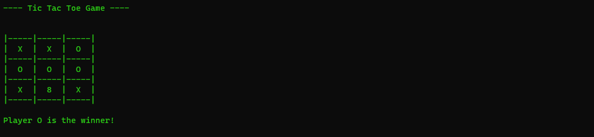

# Tic Tac Toe CLI game

- Tic Tac Toe game in command line
- Built using [Rust-lang](https://www.rust-lang.org/)
- **Multiplayer game in command line**

## Table of Contents
- [Tic Tac Toe CLI game](#tic-tac-toe-cli-game)
  - [Table of Contents](#table-of-contents)
  - [Screenshots](#screenshots)
  - [Installation](#installation)

## Screenshots





## Installation

To clone this project :

```bash
git clone "https://github.com/Noobsiecoder/tic-tac-toe-rust.git"
```
